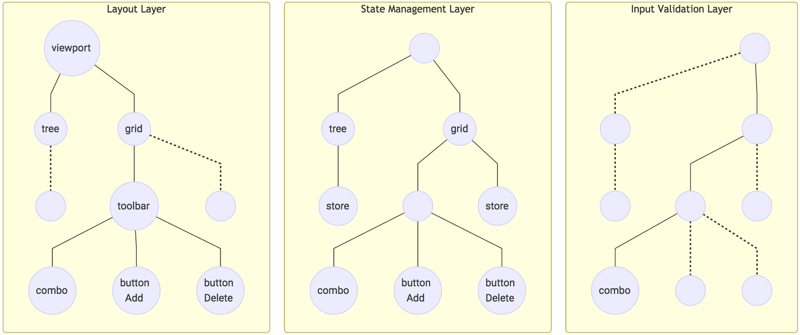

Cascading Component Layers for React
------------------------------------
Design pattern to slice complex component trees.

### Usage

```javascript
	import {createLayers, cascadeLayers, createReactElement} from 'cascading-component-layers-react'

	function render( props ){
	     const layers = createLayers( React => [
            layout: () =>
                <panel layout="border"></panel>,
            stateManagement: () =>
                <panel><store/></panel>,
  	    ])
	    return createReactElement( cascadeLayers( layers, props ))
	}
```
#### What?

Let suppose that we have some complex component tree. For Example:


```javascript
    function render(){
        return (
            <viewport layout="border">
                <tree ref="tree" displayField="letter"
                      region="west" split width="35%" pull-childs
                      on-drop={ this.moveSelected({from: 'grid', to: 'tree'}) } >
                    <store proxy="memory" model="LetterModel" pull-childs>
                        <sorters><property-letter /></sorters>
                        <root letter="English Alphabet" expanded leaf="false"/>
                    </store>
                </tree>
                <grid ref="grid" selType="checkboxmodel"
                      region="center" pull-childs
                      on-drop={ this.moveSelected({from: 'tree', to: 'grid'}) }>
                    <store proxy="memory" model="LetterModel" pull-childs>
                        <sorters><property-letter /></sorters>
                    </store>
                    <columns>
                        <column dataIndex="letter" flex="1">English letter</column>
                    </columns>
                    <toolbar dock="bottom">
                        <combo ref="available"
                               displayField="letter" queryMode="local"
                               vtype="alpha" allowBlank="false" maxLength="1" validateOnBlur="false">
                            <store proxy="memory" model="LetterModel" pull-childs>
                                <sorters><property-letter /></sorters>
                            </store>
                        </combo>
                        <button on-click={ this.moveSelected({from: 'available', to: 'grid'}) }
                                bind--disabled="{available.selected.length == 0}">
                            Add
                        </button>
                        <button on-click={ this.moveSelected({from: 'grid', to: 'available'}) }
                                bind--disabled="{grid.selected.length == 0}">
                            Delete
                        </button>
                    </toolbar>
                </grid>
            </viewport>
        )
    }
```

To refactor it, we can extract sub-nodes into separate components.

```javascript
    function render(){
        /** shared sub-component */
        function LettersStore(){
            return (
            <store proxy="memory" model="LetterModel" pull-childs>
                <sorters><property-letter /></sorters>
            </store>
        )}
        return (
            <viewport layout="border">
                <tree ref="tree" store={ LettersStore() } displayField="letter"
                      region="west" split width="35%" pull-childs
                      on-drop={ this.moveSelected({from: 'grid', to: 'tree'}) } >
                    <store pull-childs>
                        <root letter="English Alphabet" expanded leaf="false"/>
                    </store>
                </tree>
                <grid ref="grid" store={ LettersStore() } selType="checkboxmodel"
                      region="center" pull-childs
                      on-drop={ this.moveSelected({from: 'tree', to: 'grid'}) } >
                    <columns>
                        <column dataIndex="letter" flex="1">English letter</column>
                    </columns>
                    <toolbar dock="bottom">
                        <combo ref="available"
                               store={ LettersStore() } displayField="letter" queryMode="local"
                               vtype="alpha" allowBlank="false" maxLength="1" validateOnBlur="false" />
                        <button on-click={ this.moveSelected({from: 'available', to: 'grid'}) }
                                bind--disabled="{available.selected.length == 0}">
                            Add
                        </button>
                        <button on-click={ this.moveSelected({from: 'grid', to: 'available'}) }
                                bind--disabled="{grid.selected.length == 0}">
                            Delete
                        </button>
                    </toolbar>
                </grid>
            </viewport>
        )
    }
```

That's OK. But what if we want to group components and props of different nodes in our components tree?
For what? To extract abstractions like layout, state management, input validation. Different abstractions
can share the same components. 



To do that kind of splitting, we can extract these abstractions into layers and merge it on render:

```javascript
    function render(){

        const layers = createLayers( React => [

            function layout(){
                return (
                <viewport layout="border" height="400">
                    <tree region="west" split width="35%">
                        <store pull-childs>
                            <root letter="English Alphabet" expanded leaf="false"/></store></tree>
                    <grid region="center" selType="checkboxmodel" pull-childs>
                        <columns>
                            <column flex="1">English letter</column></columns>
                        <toolbar    dock="bottom">
                            <combo width="40"/>
                            <button>Add</button>
                            <button>Delete</button> </toolbar></grid></viewport>
            )},
            function stateManagement(){
                return (
                <viewport>
                    <tree ref="tree"  store={ LettersStore() }  displayField="letter"
                                    on-drop={ this.moveSelected({from: 'grid', to: 'tree'}) } />
                    <grid ref="grid"  store={ LettersStore() }
                                    on-drop={ this.moveSelected({from: 'tree', to: 'grid'}) } >
                        <combo ref="available" queryMode="local"
                                         store={ LettersStore() } displayField="letter" />
                        <button bind--disabled="{available.selected.length == 0}" disabled
                                      on-click={ this.moveSelected({from: 'available', to: 'grid'}) } />
                        <button bind--disabled="{grid.selected.length == 0}" disabled
                                      on-click={ this.moveSelected({from: 'grid', to: 'available'}) } /></grid></viewport>
            )},
            function inputValidation(){
                return (
                <viewport><grid><combo vtype="alpha" allowBlank="false" maxLength="1" validateOnBlur="false"/></grid></viewport>
            )},
        ])
        /** shared sub-component */
        function LettersStore(){
            return (
            <store proxy="memory" model="LetterModel" pull-childs>
                <sorters><property-letter /></sorters></store>
        )}

        return createReactElement( cascadeLayers( layers, this ))
    }
```

Now we can simply turn of Input Validation by removing last layer:

```javascript
    layers.pop() // <--
    return createReactElement( cascadeLayers( layers, this ))
```

#### Dash Directives

This is angular-like directives to transform layer jsx tree. For example:
```html
<xtype-tree bind--disabled="{checkbox.checked}" pull-childs>
    <store model="Letter"/>
</xtype-tree>
```
Will be transformed to:
```javascript
<tree xtype="tree" bind={ {disabled: "{checkbox.checked}"} } store={ {model: "Letter"} } />
```

### Install

Please star this repo, and I will create and publish the npm package.

### License

ISC
